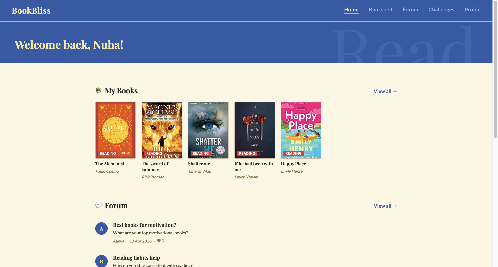
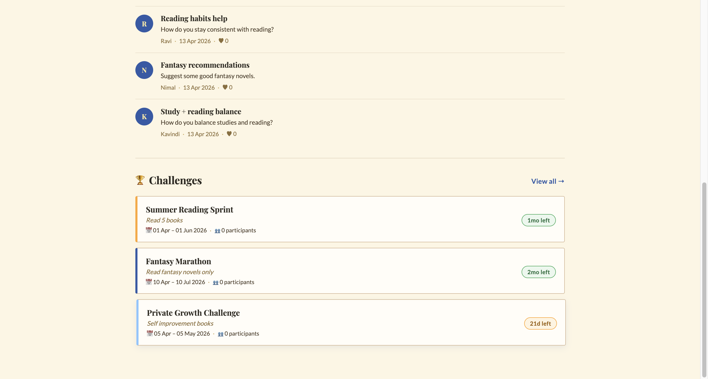
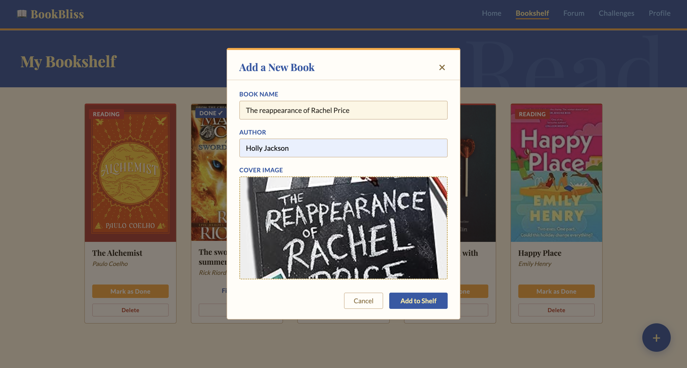
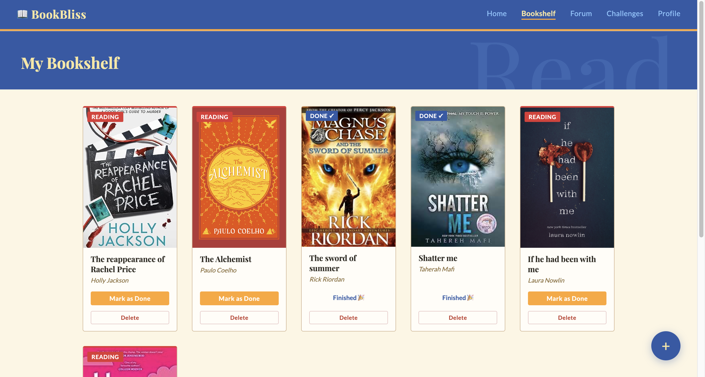
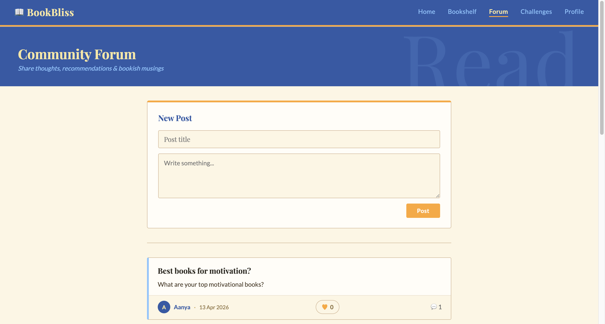
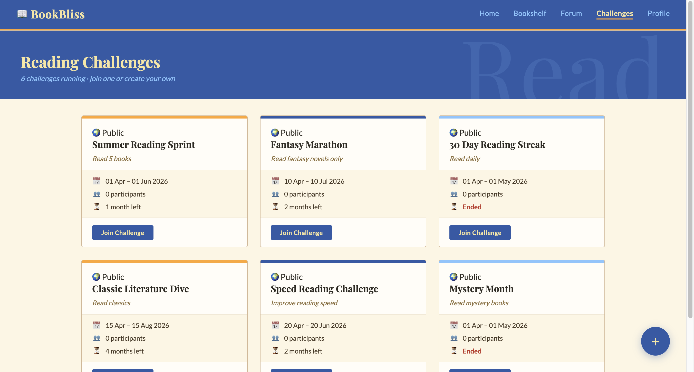
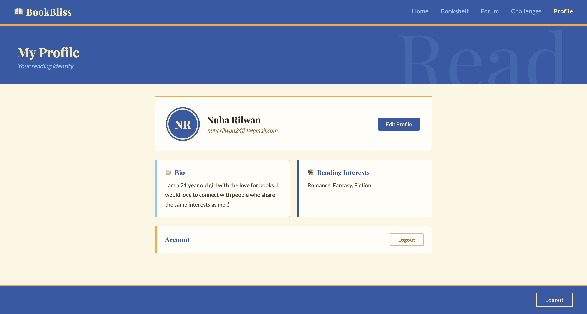

# 📚 BookBliss

BookBliss is a full-stack web application designed to bring together readers within a shared digital community. The platform enables users to connect, share their reading journeys, participate in challenges, and engage with others who have similar literary interests.

It is built as a social ecosystem for book lovers, combining community interaction with personal reading tracking features.

---

## 🌟 Features

- 👤 User registration and authentication
- 📖 Book tracking and reading progress management
- 🏆 Reading challenges and participation system
- 💬 Community interaction for book discussions
- 🧑‍💻 User profiles showcasing reading activity
- 📚 Book discovery and exploration features

---

## 🛠️ Tech Stack

- **Frontend:** HTML, CSS, JavaScript  
- **Backend:** Laravel (PHP Framework)  
- **Database:** MySQL  
- **Architecture:** MVC (Model–View–Controller)  

---

## 📸 Screenshots

### Login Page

## Registration Page

### Home Page

### Bookshelf

### Forum

### Challenges

### Profile
